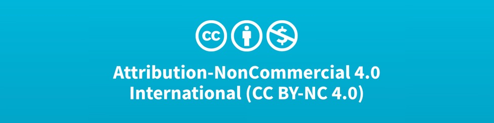

# Welkom

## Intro

Welkom bij de online cursus bibliotheek van Karel de Grote Hogeschool - Multimedia & Creative Technologies. Op deze pagina vind je een overzicht van alle profielen en online cursussen die op dit platform.


De beschikbare cursussen zijn publiek toegankelijk en beschikbaar onder de creative common licentie. \([Creative Commons Attribution-NonCommercial 4.0 International License](https://creativecommons.org/licenses/by-nc/4.0/)\) Het kan echter zijn dat op bepaalde momenten wordt verwezen naar filmpjes op het grow platform, deze zijn enkel voor studenten van de Karel de Grote Hogeschool beschikbaar.


## Hoe werken we



## Bijdragen aan onze cursus?



## Profielen



