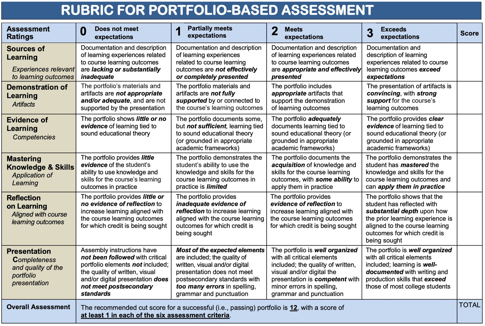
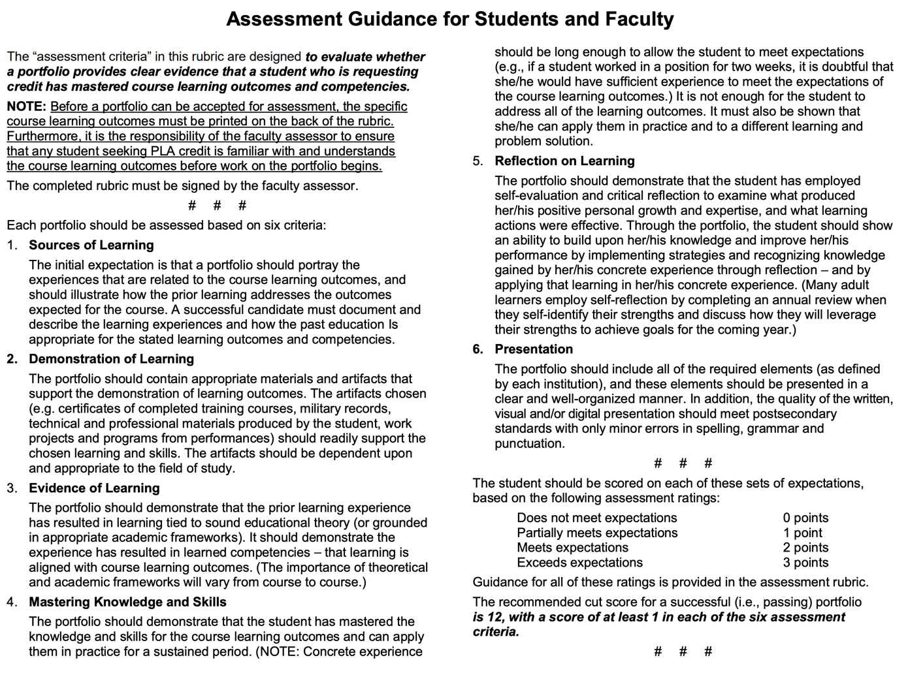
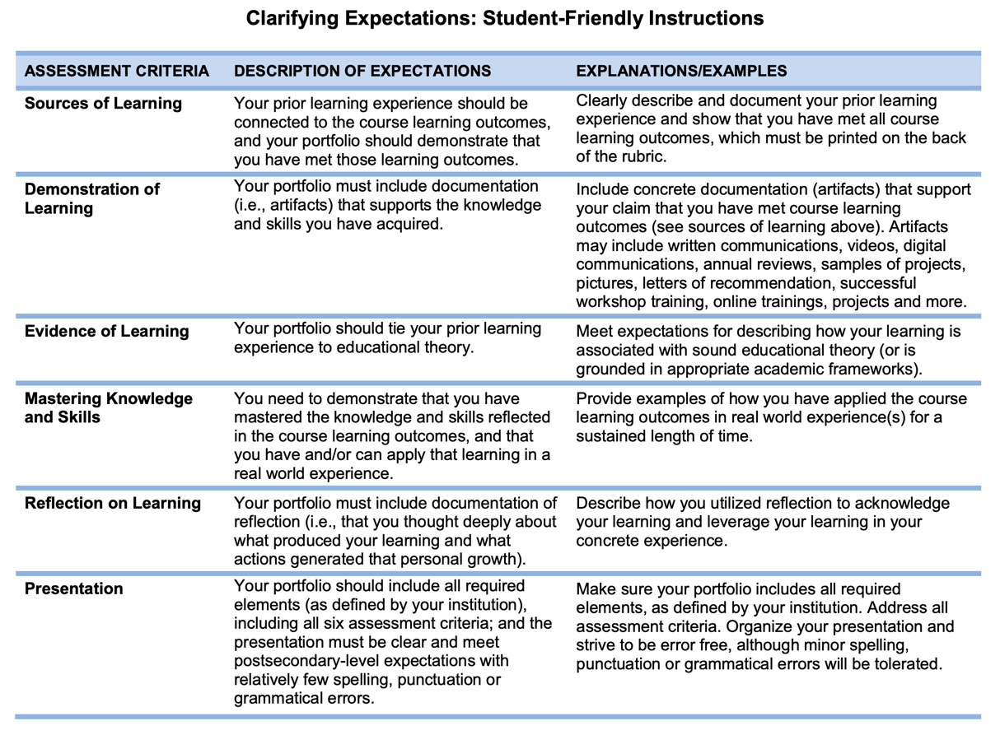

# 🎢 This is how we roll

## Introductie

Bij alle **web developer** profielen werken we met een portfolio.


Een portfolio is een door de student gemaakte doelgerichte verzameling van documentatiemateriaal uit verschillende bronnen. Naast dit materiaal maken schriftelijke beschouwingen \(zelfanalyse of reflectie\) van de student deel uit van een portfolio.


Een portfolio bestaat uit:

* Oefeningen
* Bronnen van materiaal dat je online zelf hebt opgezocht
* Zelfreflectie i.f.v. het autodidactisch proces
* Vaardigheid en/of kennis toetsen om formatief te toetsen

Iets meer in mensentaal:

* Wat je gedaan hebt: Opdrachten, onderzoek, lessen die je hebt gevolgd,...
* Wat je over de dingen denkt \(zelfreflectie\) en wat je denkt over uw process hierin
* Hoe het loopt of niet loopt \(wat gaat er goed, wat gaat er slecht\)
* Welke learning video's je hebt gevolgd, welke certificaten je hebt behaald \(include screenshots!\)
* Indien van toepassing: welke badges je gehaald hebt.

Dit portfolio wordt tijdens het examengesprek besproken met meerdere beoordelaars en deze zullen op basis van dit examengesprek en het ingeleverde portfolio een cijfer toekennen. Als het portfolio niet \(tijdig\) wordt ingediend, kan er geen examengesprek doorgaan.

## Evaluatie


Deze evaluatie verdeling geld voor zowel 1ste als 2de zit.


| Wat? | % | Opmerking |
| :--- | :--- | :--- |
| Portfolio | 60% | Google doc waar je netjes alles georganiseerd en gestructureerd hebt gedocumenteerd. |
| Examengesprek | 40% | Tijdens het examengesprek geef je aanvullende toelichting en verantwoording over je persoonlijk portfolio. |

### Rubric for portfolio-based assessment

Een goede leidraad voor hoe je zelf kan beoordelen of uw portfolio voldoende "body" heeft. Uiteraard werkt de scoring bij ons net wat anders maar voor zelf evaluatie een ideale tool!

_Bron:_ [_Stark State college_](https://www.starkstate.edu/)\_\_

