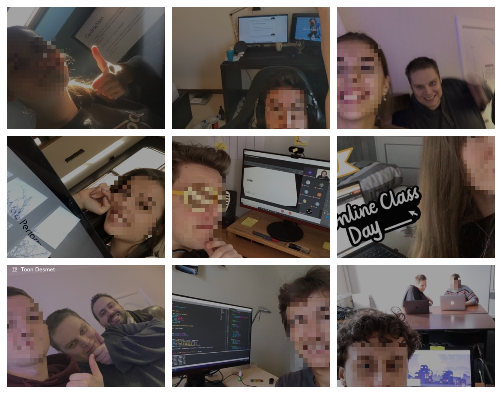

# 📸 Aanwezigheid

In een perfecte wereld willen we graag dat jullie altijd aanwezig zijn op alle live en online lessen. In de realitieit gaat dat natuurlijk niet altijd.

Streef daarom naar een absolute minimum van 50% aanwezigheid. Het spreekt voor zich dat **als je niet aanwezig kan zijn dat je zelf het nodige doet om de geziene materie in te halen of de nodige hulp te krijgen bij opdrachten**. Zet dat dan ook mee in uw portfolio hoe het komt.


Om jullie aanwezigheid te _valideren_ werken wij met een selfie systeem. Elke les dat je er bent neem je een selfie en upload je die mee in uw portfolio.



We zijn web developers en UX/UI creators. Wij weten dus hoe we een image kunnen verkleinen en een mooi grid kunnen maken in een portfolio 😬\(dus geen foto's van 10MB die allemaal huge ass onder elkaar staan 🤦‍♂️\)


