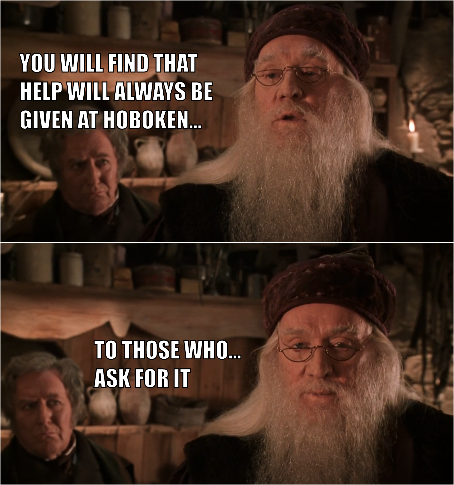

# 🦸‍♂️ You rock!

## Bedrijven, alumni, ... We need you!


Het idee achter deze publieke online cursus is dat deze verrijkt kan worden door alumni en werkveld.


Heb je tijd en zin om ons te **helpen** om binnen onze **cursussen** de puntjes op de ‘i’ te zetten? Of wil je **bijdragen** door je **expertise** te **delen** om bij te dragen bij aan de opleiding van onze student en op die manier de opleiding voor onze studenten kwaliteitsvoller te maken? **Dat kan!**

Snelle aanpassingen kan je doen door een **pull request** te doen met de gewenste changes. Wil je **meer doen** en een **hoofdstuk of mini course** toevoegen? Ook dat kan! Contacteer [sam.serrien@kdg.be](mailto:sam.serrien@kdg.be) om een **account** op onze **gitbook** te krijgen zodat je gebruik kan maken van al de **rijke features** die deze software biedt.


Op elke pagina staat er een _`edit on github`_ link zodat je de gewenste pagina snel kan terugvinden op github.


Je vindt al onze cursussen terug op [github.com/mctantwerp](https://github.com/mctantwerp), de repositories van onze cursussen starten allemaal met **"learn-**" in hun naam.

In de gitbook pagina's kan je normale markdown gebruiken die aangevuld wordt met gitbook specifieke markdown.


Markdown hulp nodig? Zie [https://commonmark.org/help/](https://commonmark.org/help/)  
Voor de specifieke gitbook mogelijkheden in markdown kan je hier terecht: [https://docs.gitbook.com/editing-content/markdown](https://docs.gitbook.com/editing-content/markdown)


### Nog meer bijdragen? Maar wat dan? en hoe? en is dat niet kei veel werk? Waarom zou ik dat doen?

Het waarom is makkelijk. Hoewel velen van ons \(docenten\) meestal met nog een half been in het werkveld staan geven we in de eerste plaats vooral les. We doen ons best maar het is zeer moeilijk om op een experten niveau te blijven met dergelijk breed aanbod aan materie. Daarom lijkt het ons super interessant dat jullie: werkveld, alumni en zelfs studenten ons hiermee kunnen helpen. Op die manier leveren we 'top notch' studenten af die op hun beurt prachtige projecten voor jullie klanten zullen maken... **Samen staan we sterk, right?**

### Mini Courses

Naast het **verbeteren en verrijken** van onze cursussen denken wij dat het ook fantastisch zou zijn dat **werkveld partners eigen mini courses kunnen toevoegen**. Hierdoor kan je zelf als bedrijf mee **sturen** waar **onze studenten mee in aanraking komen** en zo al een extra **stap voor** hebben als ze later **collega's** zouden worden.


Dit hoeven geen volledige boeken te zijn? Je kan altijd kort uitleg geven over een bepaalde topic, enkele externe links naar extra informatie en/of video's en klaar. Al wordt het meer uitgebreidere werk uiteraard ook geapprecieerd!


And never forget ...

> You will find that help will always be given at hoboken... To those who... ask for it

